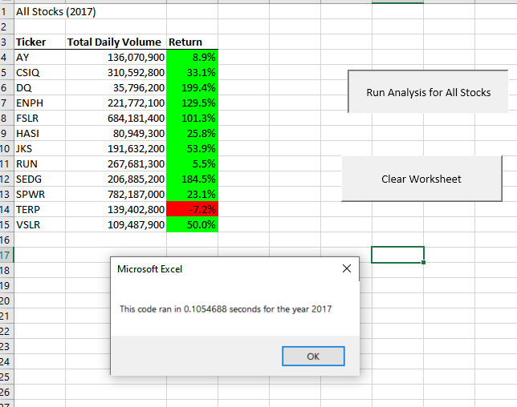
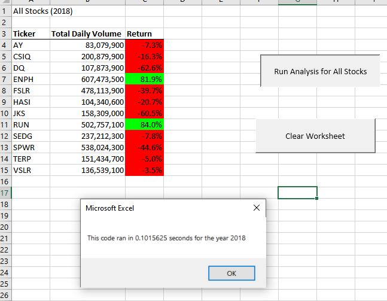

# Stock-analysis

## Overview of Project

### This project aims to assist Steve and his parents in Daqo's stock (DQ) and whether they should invest. We examined stock data to find the total daily volume, or shares traded throughout the day, and yearly return for each stock, or difference in price from beginning to end of year. Data was analyzed for the years 2017 and 2018.

## Results

### Performance of all stocks is shown below. In 2017 DQ did perform much better than in 2018 with a return percentage of 199.4% versus -62.6% respectively. It seems all stocks but TERP had a positive return in 2017. in 2018 only two stocks, ENPH and RUN had a positive return.

### After adjusting the original script for this analysis, our run time was much lower at 0.11 seconds for year 2017 and 0.01 seconds for year 2018. The original scripts took almost a full second to run.

## Summary

### Upon refactoring code we see some advantages and disadvantages. One advantage working with the original code from the stock analysis worksheets was a more efficient script. Another benefit was that refactoring yielded a faster execution time. This could be very useful when analyzing larger datasets. 

### Disadvantages to refactoring include having to debug the code and ensure it provides the same function as the original. In the stock analysis, trying to yield the same results in the refactored code proved challenging even though the changes were minor.

